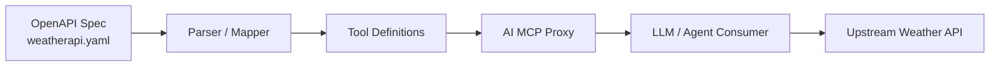

# OpenAPI to MCP Tool Conversion with Kong

This project demonstrates how an OpenAPI specification can be transformed into MCP-compatible tools through Kong. The flow maps OpenAPI paths and operations into tool definitions that an MCP proxy can expose to an AI agent.

## Design Overview

The conversion process follows a simple design pattern:



### Design Flow

1. Define the API contract in an OpenAPI file.
2. Extract operations such as GET /current.json and GET /forecast.json.
3. Convert each operation into an MCP tool definition.
4. Expose those tools through a Kong MCP proxy route.
5. Let an AI client invoke the tools through the MCP interface.

## Example Input

The OpenAPI definition in [weatherapi.yaml](weatherapi.yaml) exposes:

- `get_current_weather`
- `get_weather_forecast`

These are converted into MCP tools with names such as:

- `get-current-weather`
- `get-weather-forecast`

## Generated Kong Configuration

The generated proxy config is available in [kong-mcp.yaml](kong-mcp.yaml). It contains a Kong route configured with the `ai-mcp-proxy` plugin and a `conversion-listener` mode.

### Key parts of the config

- `services` → defines the upstream target
- `routes` → exposes the MCP endpoint
- `plugins` → contains the MCP conversion configuration
- `tools` → lists the generated MCP tools

## How the Conversion Works

For each OpenAPI operation:

- the HTTP method is mapped to a tool action
- the path is preserved as the tool endpoint
- query parameters become tool parameters
- descriptions and annotations are carried into the MCP metadata

## Local Usage

### 1. Start Kong

Run Kong in DB-less mode with the generated config:

```bash
docker run -d --name kong-rest2mcp \
  -e "KONG_DATABASE=off" \
  -e "KONG_DECLARATIVE_CONFIG=/usr/local/kong/kong.yaml" \
  -e "KONG_PROXY_LISTEN=0.0.0.0:8000" \
  -e "KONG_ADMIN_LISTEN=0.0.0.0:8001" \
  -v "$PWD/kong-mcp.yaml:/usr/local/kong/kong.yaml" \
  -p 8000:8000 \
  -p 8001:8001 \
  kong:latest
```

### 2. Validate the config

```bash
deck gateway validate kong-mcp.yaml
```

### 3. Sync the config

```bash
deck gateway sync kong-mcp.yaml --kong-addr http://127.0.0.1:8001
```

## Notes

- This example shows a declarative conversion pattern from OpenAPI to MCP tools.
- In production, you can add authentication, rate limiting, and additional tool metadata.
- The MCP route becomes the interface through which AI clients discover and invoke tools.
